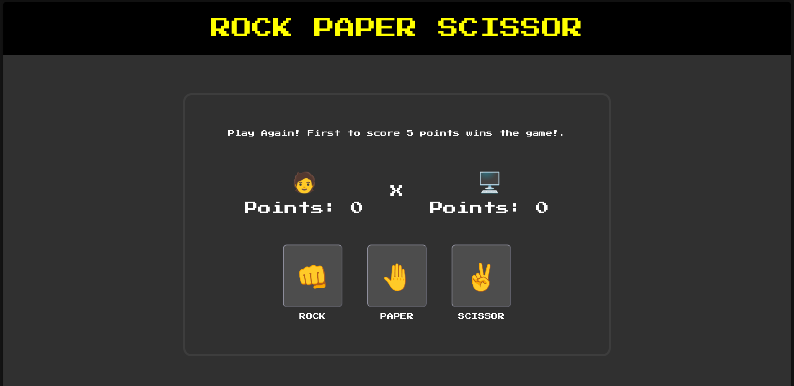

<h1 align='center'>🎮 ROCK PAPER SCISSORS</h1>

  <a href='#-sobre'>Sobre</a>
  &nbsp&nbsp|&nbsp&nbsp
  <a href='#-desenvolvimento'>Desenvolvimento</a>
  &nbsp&nbsp|&nbsp&nbsp
  <a href='#-tecnologias'>Tecnologias</a>
  &nbsp&nbsp|&nbsp&nbsp
  <a href='#-licencas'>Licença</a>
  &nbsp&nbsp|&nbsp&nbsp
  <a href='https://www.figma.com/community/file/1422676439178901872/caffucinho'>Protótipo</a>

    

    

## 💁‍♂️ Sobre o Projeto
Este projeto consiste em um jogo clássico de Pedra, Papel e Tesoura, onde o usuário joga contra o computador.

O objetivo é ser o primeiro a alcançar 5 pontos, com um sistema de pontuação dinâmico e interface interativa.

Além disso, o jogo conta com uma tela final animada mostrando o resultado da partida (vitória ou derrota), proporcionando uma melhor experiência ao usuário.

## 📅 Desenvolvimento
O projeto foi realizado no primeiro semestre de 2026, sendo meu primeiro toque ao JavaScript.

## 🤖 Tecnologias
Esse projeto foi realizado com as seguintes tecnologias:
<ul>
    <li>HTLM</li>
    <li>CSS</li>
    <li>JavaScript</li>
    <li>Git e Github</li>
</ul>

## 🔑 Licença
Este projeto está sob a licença MIT.

___

Desenvolvido por Murilo Silva Papacidero 👤
